# Vuejs Code Block

[](https://www.npmjs.com/package/vuejs-code-block)

<div align="center">
  <a href="https://hetari.github.io/vuejs-code-block/">
    
  </a>
</div>

> [!IMPORTANT]
> For now this package has default themes, but in the future, it will be fully unstyled, allowing you to style it however you like.

## Installation

To get started, install the package via npm:

```bash
npm install vuejs-code-block
```

Alternatively, if you're using Yarn:

```bash
yarn add vuejs-code-block
```

## Basic Usage

Once installed, you can start using the `CodeBlock` component in your `Vue 3` app to display syntax-highlighted code. Here’s a simple example:

```vue ts:line-numbers {1}
<template>
  <CodeBlock
    :code="code"
    :numbered="true"
    :show-header="true"
    file-name="codeBlock.ts"
    language="ts"
    theme="dracula">
  </CodeBlock>
</template>

<script setup lang="ts">
  import { CodeBlock } from './components/code-block';
  const code = `const name =  'Vuejs Code Block';
const usrls = {
  github: 'https://github.com/hetari/vuejs-code-block',
  docs: 'https://hetari.github.io/vuejs-code-block/'
};`;
</script>
```

> [!WARNING] WARNING ❗
> Make sure the content of the `codeExample` string does **NOT** have leading spaces.
> The code should be formatted like this:
>
> ```ts
> const codeExample = `
> function greet(name) {
>   console.log('Hello, ' + name);
> }
> 
> greet('World');
> `;
> ```
>
> Avoid writing it with leading spaces like this:
>
> ```ts
> const codeExample = `
>   function greet(name) {
>     console.log('Hello, ' + name);
>   }
> 
>   greet('World');
> `;
> ```
>
> Incorrect formatting may cause unexpected whitespace in the code block.

<!-- - **`codeClass`** (optional): A custom CSS class for the `<code>` element inside the block. This allows you to style the code content specifically. -->
<!-- - **`linesHighlighted`** (optional): An array of line numbers to be highlighted. Accepts an array of strings or numbers (e.g., `[1, 3]` to highlight the 1st and 3rd lines). -->
<!-- - **`wordsHighlighted`** (optional): An array of specific words to be highlighted within the code. Accepts an array of strings (e.g., `['console', 'log']`). -->

## Props:

| Prop         | Type      | Required | Default | Description                                                                                |
| ------------ | --------- | -------- | ------- | ------------------------------------------------------------------------------------------ |
| `code`       | `string`  | Yes      | N/A     | The code you want to display, passed as a string.                                          |
| `language`   | `string`  | Yes      | N/A     | Specifies the programming language for syntax highlighting.                                |
| `theme`      | `string`  | Yes      | N/A     | Specifies the theme to be used for syntax highlighting (light or dark).                    |
| `asElement`  | `string`  | No       | `<pre>` | Defines the HTML element wrapping the code block (defaults to `<pre>`).                    |
| `numbered`   | `boolean` | No       | `false` | Displays line numbers when set to `true`.                                                  |
| `showHeader` | `boolean` | No       | `true`  | Displays the code block header (title, language icon, and copy button) when set to `true`. |
| `file-name`  | `string`  | No       | N/A     | The name of the file to be displayed in the header.                                        |

<!-- ## Custom Styling

One of the key features of **vuejs-code-block** is that it provides **unstyled** components, allowing you to style them however you like. For example, using CSS or Tailwind classes:

```vue
<template>
  <div class="p-4 bg-gray-800 rounded-lg">
    <CodeBlock
      theme="dark"
      :code="exampleCode"
      language="javascript" />
  </div>
</template>

<script setup>
  import { CodeBlock } from 'vuejs-code-block';

  const exampleCode = `function greet(name) {
  console.log('Hello, ' + name);
}

greet('World');
`;
</script>
```
-->

## Themes:

| Theme Name                  | Image                                                                 |
| --------------------------- | --------------------------------------------------------------------- |
| Dracula                     | 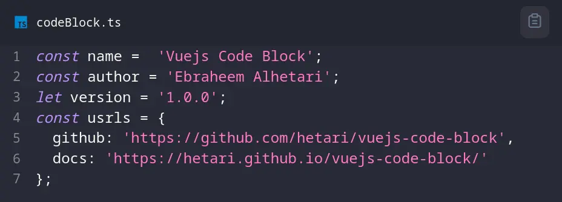                     |
| Duotone Dark                | 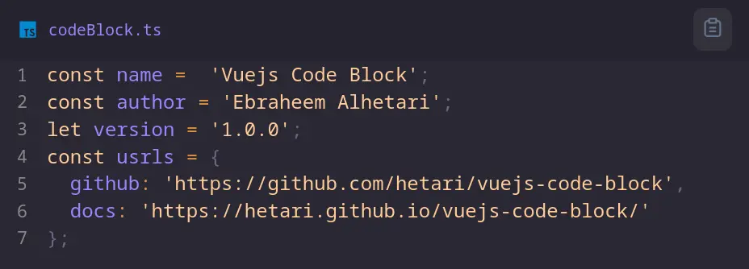            |
| Duotone Light               | 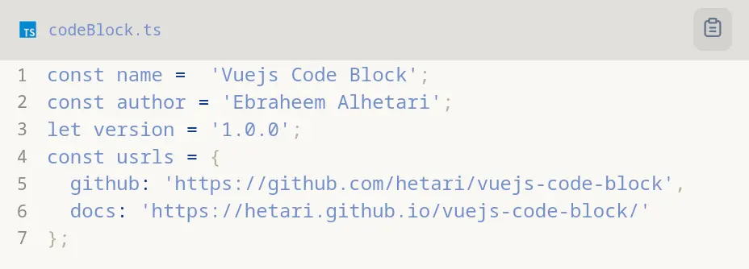          |
| GitHub                      | 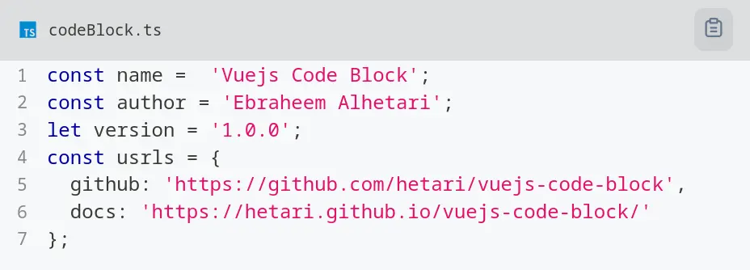                       |
| Night Owl                   | 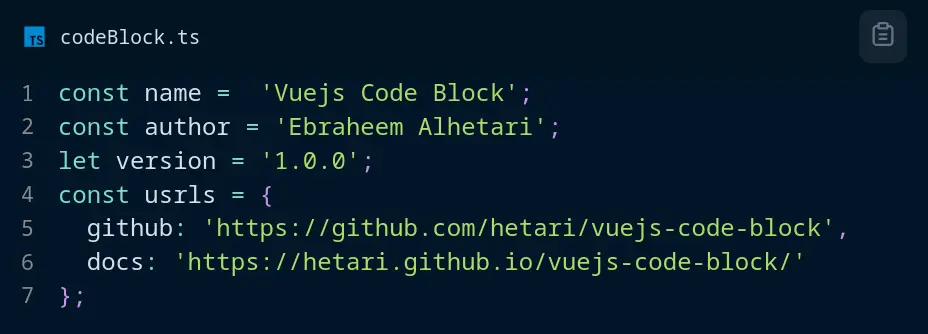                  |
| None                        | 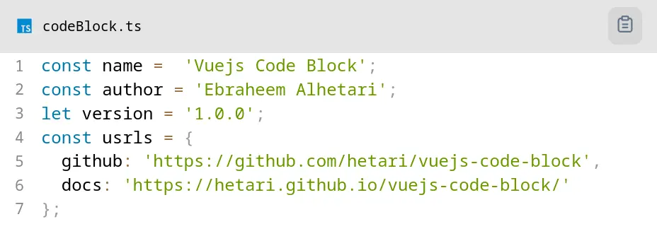                                      |
| Oceanic Next                | 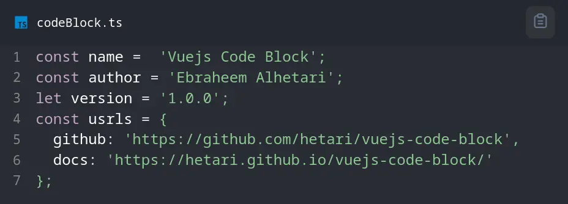            |
| Prism Dark                  | 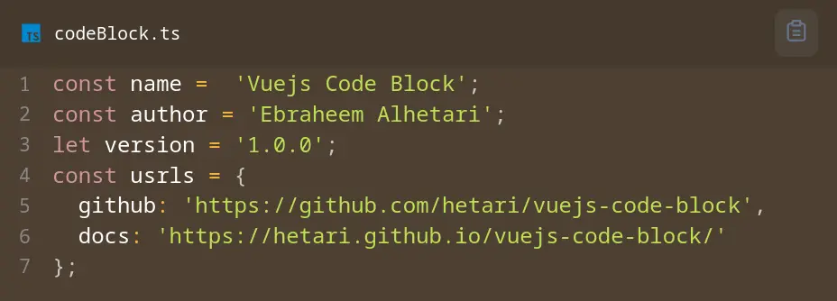                |
| Prism Funky                 | 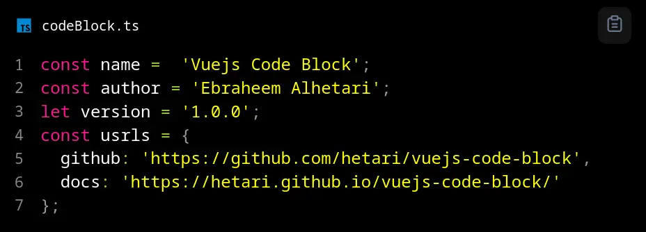              |
| Prism Okaidia               | 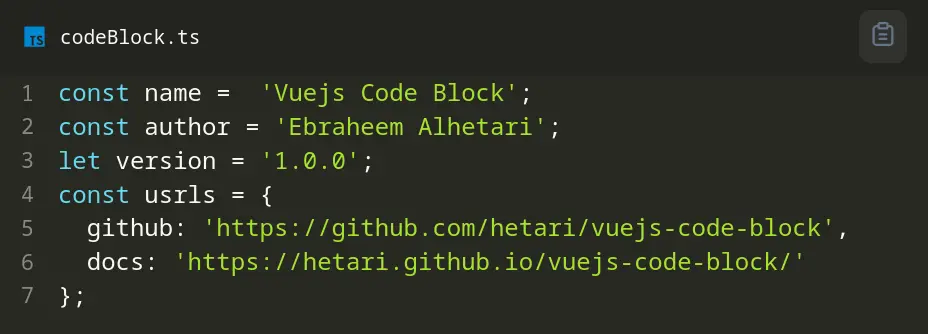          |
| Prism Solarized Light Theme | 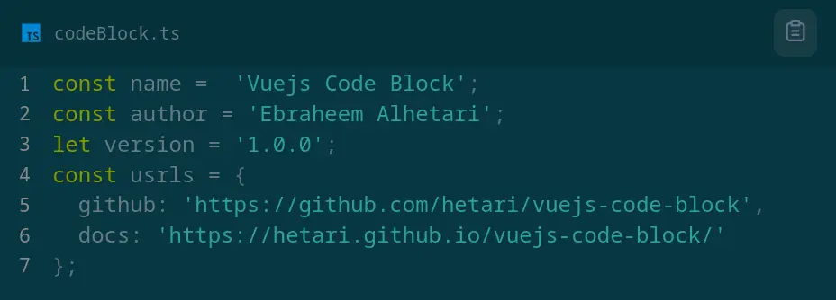 |
| Prism                       | 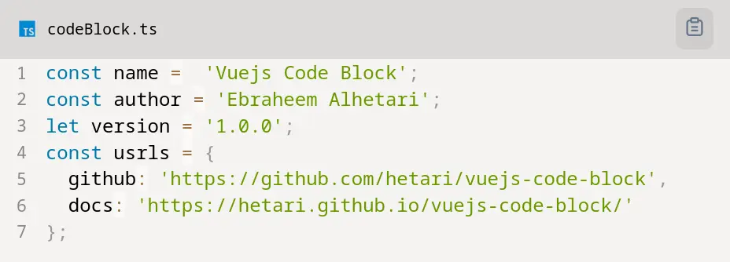                         |
| Prism Theme Coy             | 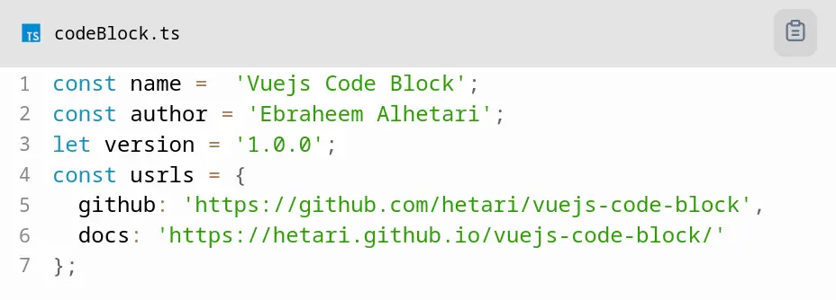                  |
| Prism Tomorrow              | 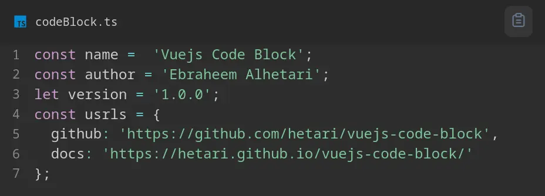        |
| Prism Twilight              | 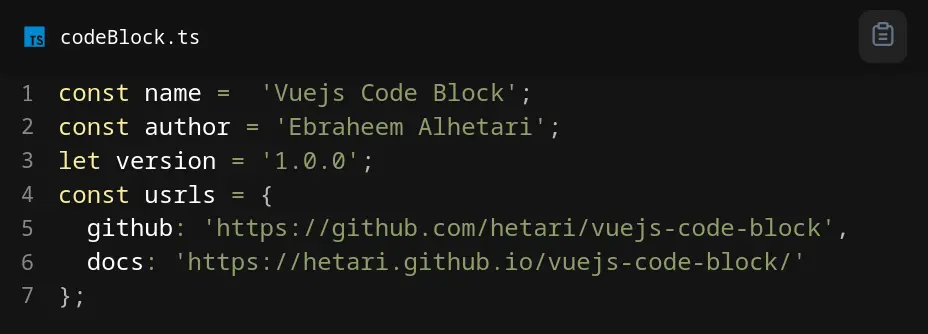        |
| Shades of Purple            | 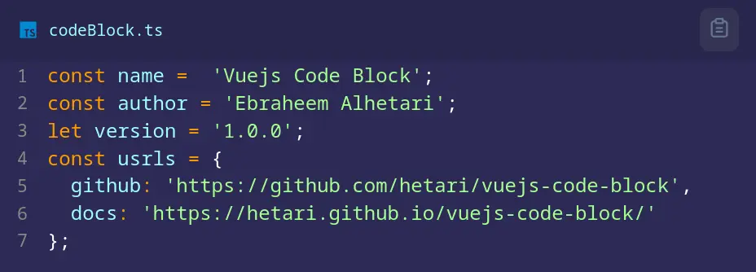                |
| UltraMin                    | 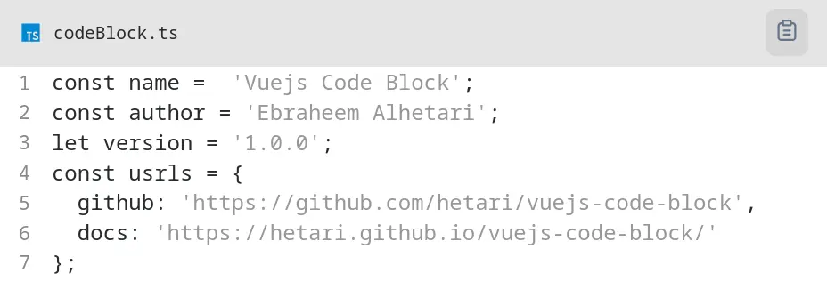                   |
| VS Dark                     | 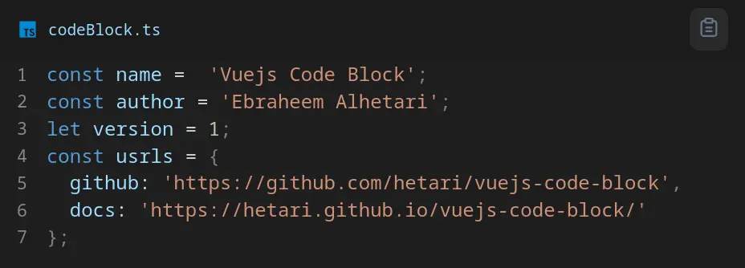                      |
